# 🏗️ KidsStream - System Architecture

## 📋 Tổng quan Kiến trúc

KidsStream được thiết kế theo mô hình **3-tier architecture** với các lớp rõ ràng và khả năng mở rộng cao.

```
┌─────────────────────────────────────────────────────────────┐
│                    PRESENTATION LAYER                       │
│  ┌─────────────┐  ┌─────────────┐  ┌─────────────┐         │
│  │   React.js  │  │ Mobile App  │  │   Admin     │         │
│  │  Frontend   │  │  (Future)   │  │   Panel     │         │
│  └─────────────┘  └─────────────┘  └─────────────┘         │
└─────────────────────────────────────────────────────────────┘
                            │
                            ▼
┌─────────────────────────────────────────────────────────────┐
│                   APPLICATION LAYER                         │
│  ┌─────────────┐  ┌─────────────┐  ┌─────────────┐         │
│  │  FastAPI    │  │   Redis     │  │   Nginx     │         │
│  │   Server    │  │   Cache     │  │ Load Balancer│        │
│  └─────────────┘  └─────────────┘  └─────────────┘         │
└─────────────────────────────────────────────────────────────┘
                            │
                            ▼
┌─────────────────────────────────────────────────────────────┐
│                     DATA LAYER                              │
│  ┌─────────────┐  ┌─────────────┐  ┌─────────────┐         │
│  │ PostgreSQL  │  │ File System │  │  YouTube    │         │
│  │  Database   │  │   Storage   │  │    API      │         │
│  └─────────────┘  └─────────────┘  └─────────────┘         │
└─────────────────────────────────────────────────────────────┘
```

## 🔧 Core Components

### 1. Frontend Layer (React.js)

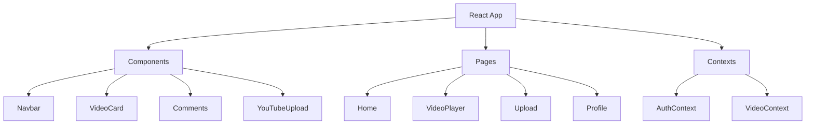

**Responsibilities:**
- User interface rendering
- State management (React Context)
- API communication
- Client-side routing
- Real-time updates

**Key Technologies:**
- React 18 with Hooks
- React Router for SPA routing
- Axios for HTTP requests
- Tailwind CSS for styling
- React Player for video playback

### 2. Backend Layer (FastAPI)

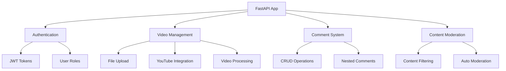

**Responsibilities:**
- REST API endpoints
- Authentication & authorization
- Business logic processing
- Database operations
- File processing & storage
- External API integration

**Key Technologies:**
- FastAPI framework
- SQLAlchemy ORM
- Pydantic for data validation
- JWT for authentication
- FFmpeg for video processing

### 3. Database Layer (PostgreSQL)

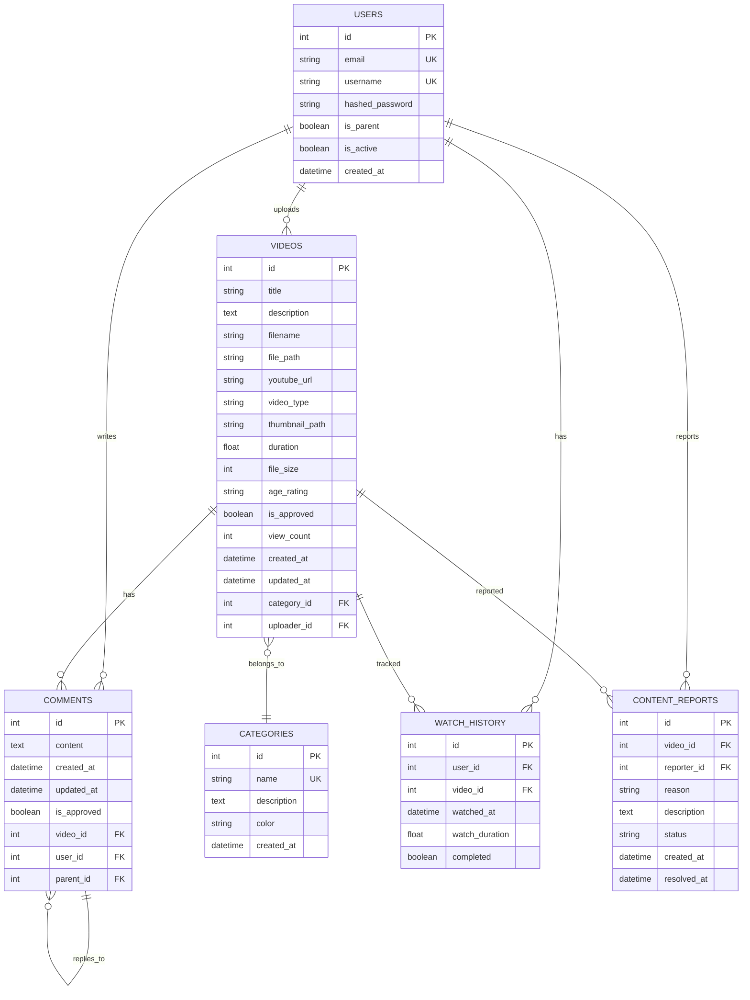

## 🔄 Data Flow Architecture

### 1. Video Upload Flow (Local Files)

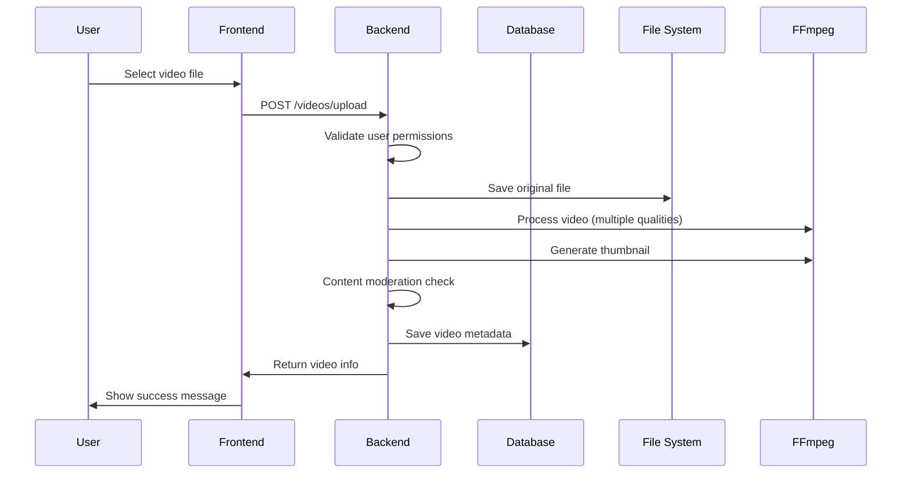

### 2. YouTube Video Integration Flow

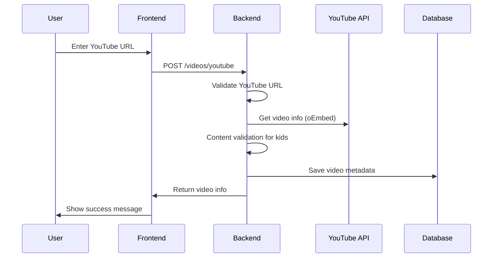

### 3. Comment System Flow

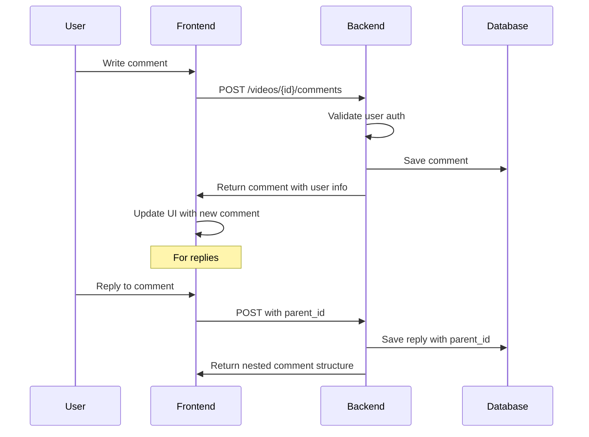

## 🚀 Deployment Architecture

### Development Environment

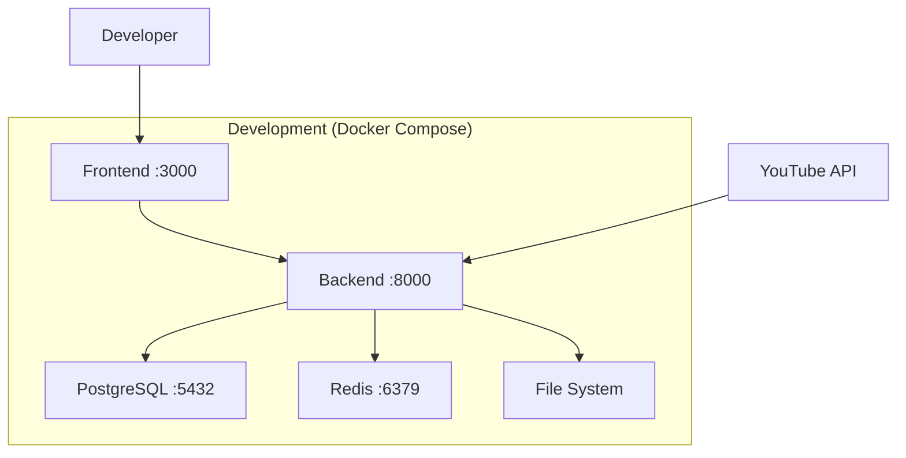

### Production Environment

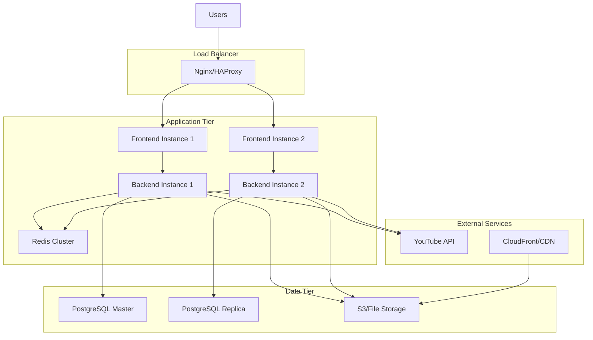

## 🔐 Security Architecture

### Authentication Flow

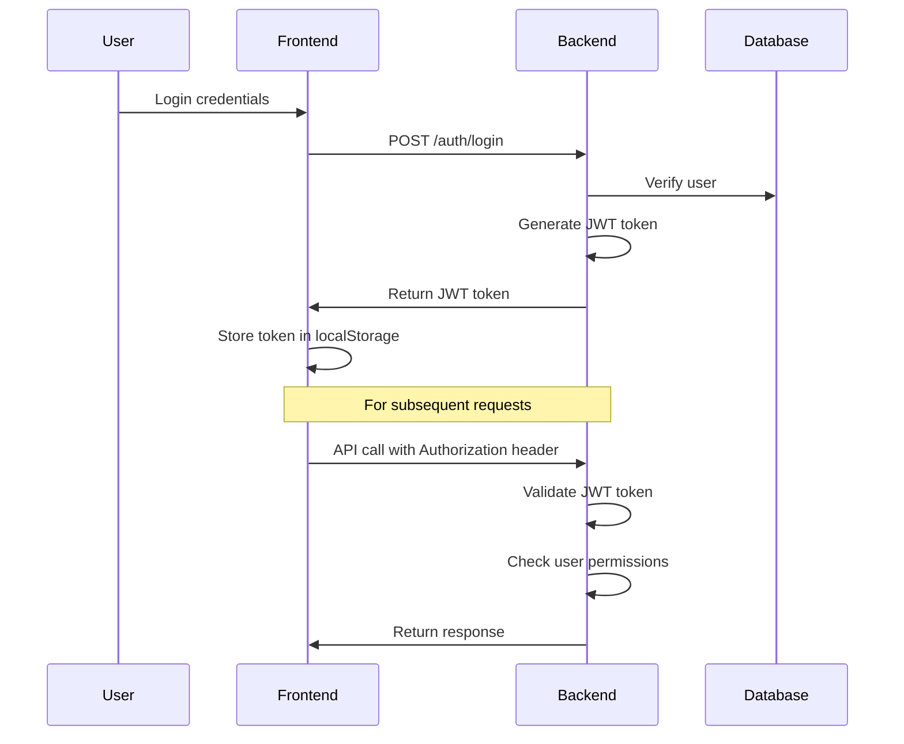

### Authorization Matrix

| Resource | Child Account | Parent Account | Admin |
|----------|---------------|----------------|-------|
| View Videos | ✅ | ✅ | ✅ |
| Upload Videos | ❌ | ✅ | ✅ |
| Add YouTube Videos | ❌ | ✅ | ✅ |
| Comment | ✅ | ✅ | ✅ |
| Edit Own Comments | ✅ | ✅ | ✅ |
| Delete Any Comments | ❌ | ✅ | ✅ |
| Moderate Content | ❌ | ❌ | ✅ |

## 📊 Performance Architecture

### Caching Strategy

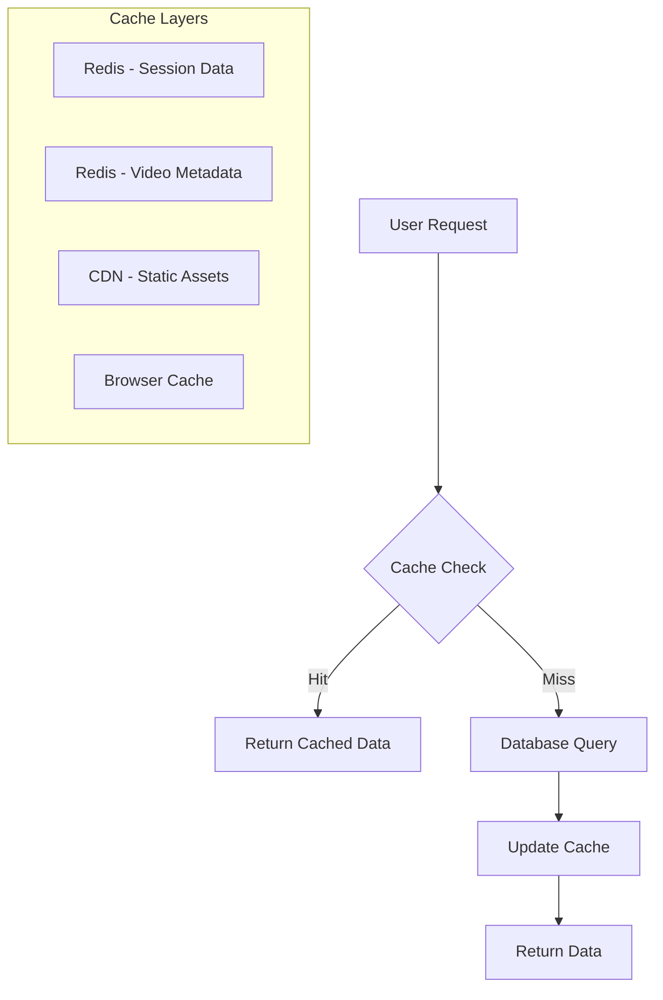

**Cache TTL Settings:**
- User sessions: 30 minutes
- Video metadata: 1 hour
- Category list: 24 hours
- Static assets: 30 days

### Database Optimization

```sql
-- Performance Indexes
CREATE INDEX idx_videos_approved ON videos(is_approved);
CREATE INDEX idx_videos_category_rating ON videos(category_id, age_rating);
CREATE INDEX idx_comments_video_approved ON comments(video_id, is_approved);
CREATE INDEX idx_users_email ON users(email);
CREATE INDEX idx_videos_created_at ON videos(created_at DESC);

-- Composite Indexes for common queries
CREATE INDEX idx_videos_search ON videos(is_approved, category_id, age_rating, created_at DESC);
```

## 🔄 Scalability Patterns

### Horizontal Scaling

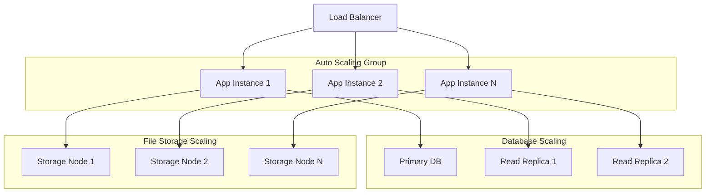

### Microservices Migration Path

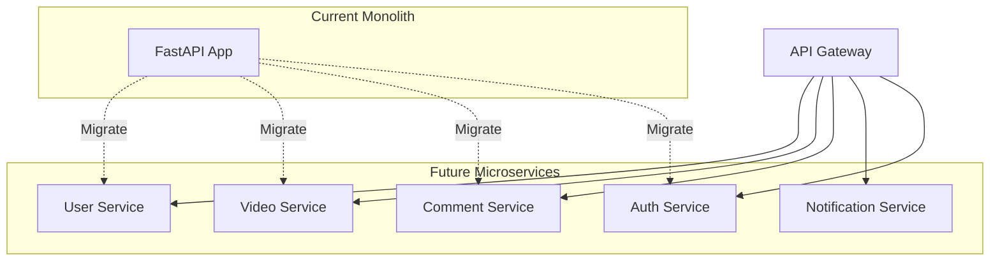

## 📈 Monitoring & Observability

### Metrics Collection

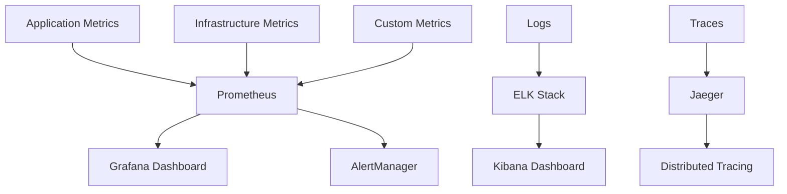

**Key Metrics:**
- Request rate & latency
- Error rate by endpoint
- Database connection pool
- Video processing queue
- Cache hit/miss ratio
- User engagement metrics

### Health Checks

```python
# Health check endpoints
@app.get("/health")
async def health_check():
    return {
        "status": "healthy",
        "timestamp": datetime.utcnow(),
        "version": "1.0.0"
    }

@app.get("/health/db")
async def db_health_check():
    # Check database connectivity
    pass

@app.get("/health/redis")
async def redis_health_check():
    # Check Redis connectivity
    pass
```

## 🔧 Configuration Management

### Environment-based Configuration

```yaml
# docker-compose.dev.yml
version: '3.8'
services:
  backend:
    environment:
      - ENV=development
      - DEBUG=true
      - LOG_LEVEL=debug

# docker-compose.prod.yml
version: '3.8'
services:
  backend:
    environment:
      - ENV=production
      - DEBUG=false
      - LOG_LEVEL=info
```

### Feature Flags

```python
# Feature flag configuration
FEATURE_FLAGS = {
    "ENABLE_YOUTUBE_INTEGRATION": True,
    "ENABLE_AUTO_MODERATION": True,
    "ENABLE_COMMENTS": True,
    "ENABLE_LIVE_STREAMING": False,  # Future feature
    "MAX_VIDEO_SIZE_MB": 500,
    "MAX_COMMENT_LENGTH": 1000
}
```

## 🚨 Error Handling & Recovery

### Circuit Breaker Pattern

```python
from circuitbreaker import circuit

@circuit(failure_threshold=5, recovery_timeout=30)
def call_youtube_api(video_url):
    # YouTube API call with circuit breaker
    pass
```

### Graceful Degradation

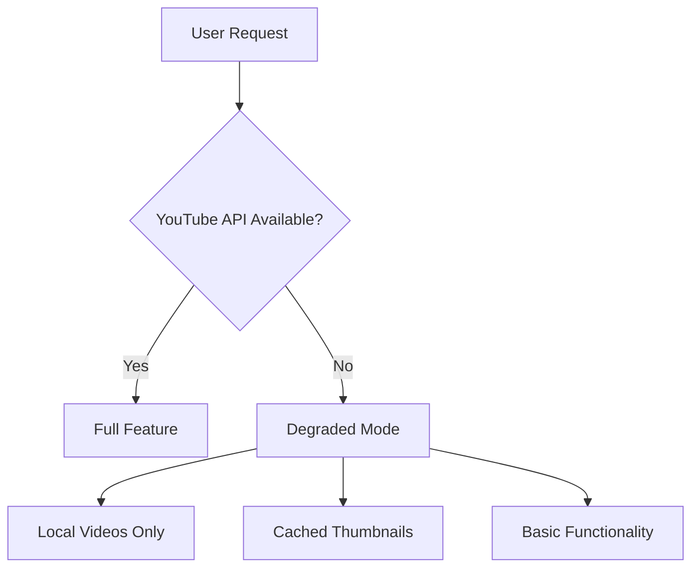

## 📱 Future Architecture Considerations

### Mobile App Integration

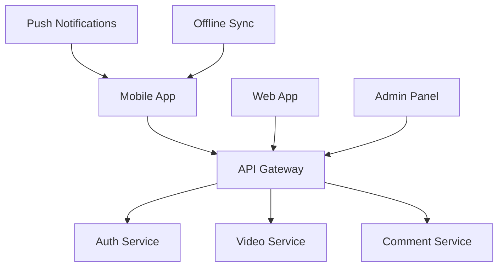

### Real-time Features

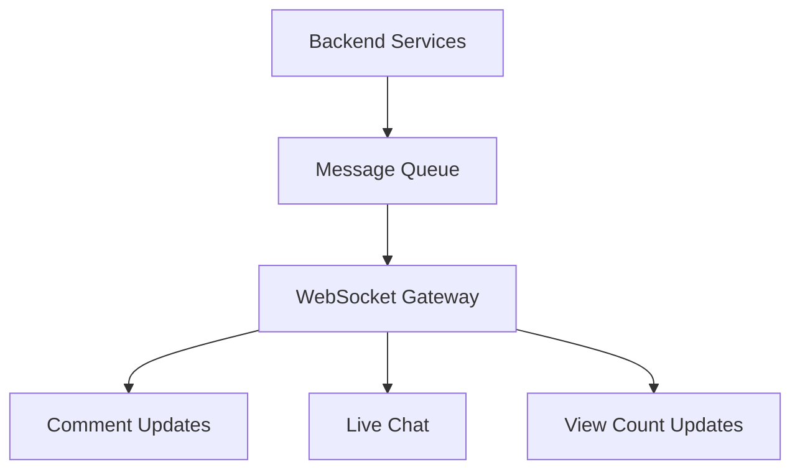

---

📝 **Lưu ý**: Kiến trúc này được thiết kế để có thể mở rộng và thích ứng với sự phát triển của ứng dụng. Các component có thể được tách riêng thành microservices khi cần thiết.