# 🏗️ KidsStream - System Architecture Diagram

## 📊 High-Level System Overview

```mermaid
graph TB
    subgraph "User Layer"
        U1[Children Users]
        U2[Parent Users]
        U3[Admin Users]
    end
    
    subgraph "Frontend Layer"
        WEB[React.js Web App]
        MOB[Mobile App<br/>(Future)]
    end
    
    subgraph "API Gateway"
        LB[Nginx Load Balancer]
        SSL[SSL Termination]
    end
    
    subgraph "Application Layer"
        API1[FastAPI Instance 1]
        API2[FastAPI Instance 2]
        CACHE[Redis Cache]
    end
    
    subgraph "Data Layer"
        DB[(PostgreSQL Database)]
        FILES[File System Storage]
        LOGS[(Log Storage)]
    end
    
    subgraph "External Services"
        YT[YouTube API]
        CDN[CDN/S3 Storage]
        SMTP[Email Service]
    end
    
    U1 --> WEB
    U2 --> WEB
    U3 --> WEB
    U1 --> MOB
    U2 --> MOB
    
    WEB --> SSL
    MOB --> SSL
    SSL --> LB
    
    LB --> API1
    LB --> API2
    
    API1 --> DB
    API1 --> CACHE
    API1 --> FILES
    API1 --> YT
    API1 --> CDN
    API1 --> SMTP
    
    API2 --> DB
    API2 --> CACHE
    API2 --> FILES
    API2 --> YT
    API2 --> CDN
    API2 --> SMTP
    
    API1 --> LOGS
    API2 --> LOGS
```

## 🔄 Data Flow Architecture

### 1. User Authentication Flow
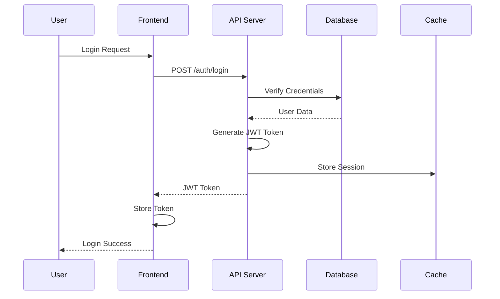

### 2. Video Upload & Processing Flow
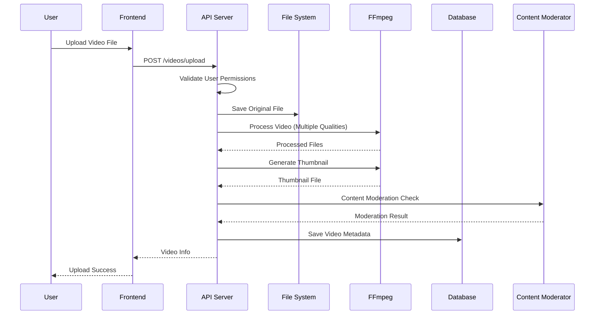

### 3. YouTube Video Integration Flow
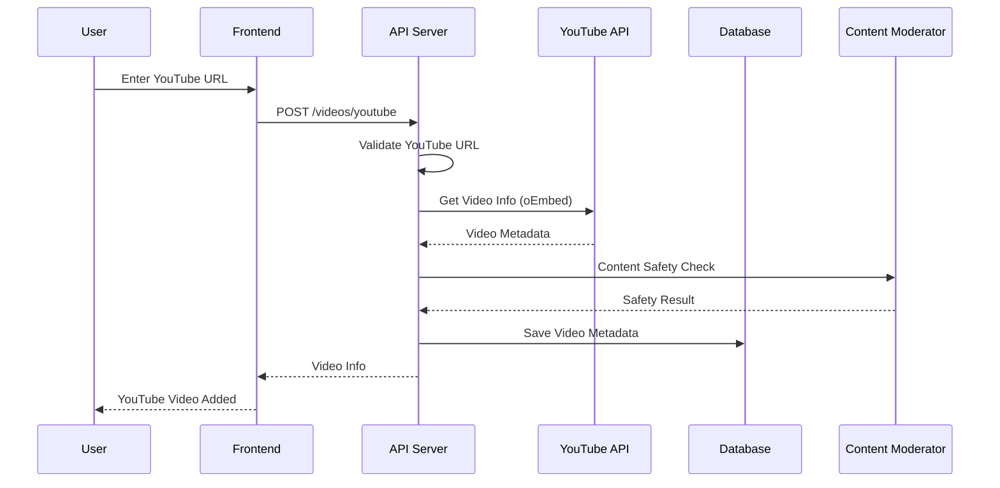

### 4. Comment System Flow
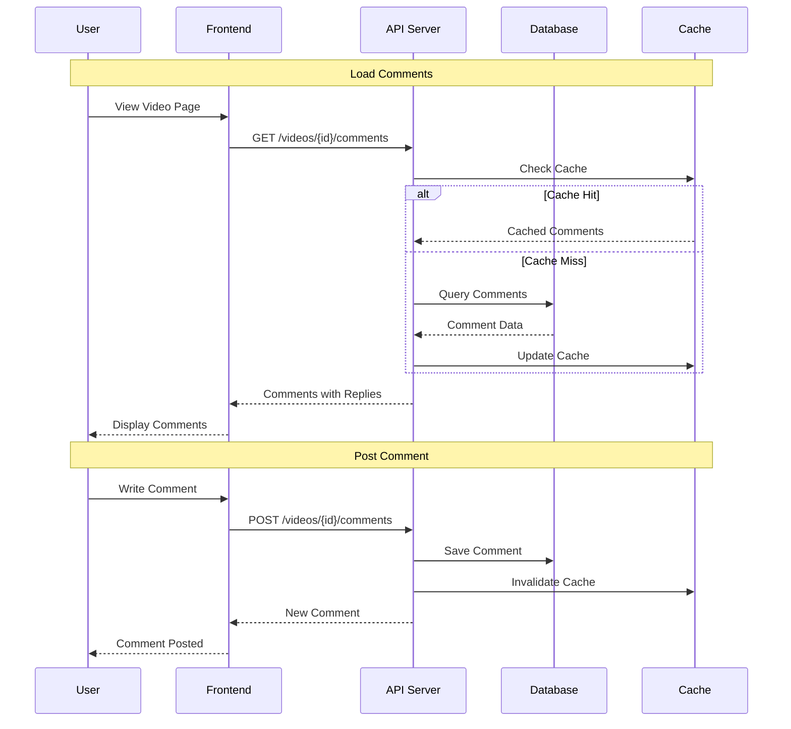

## 🗄️ Database Schema Diagram

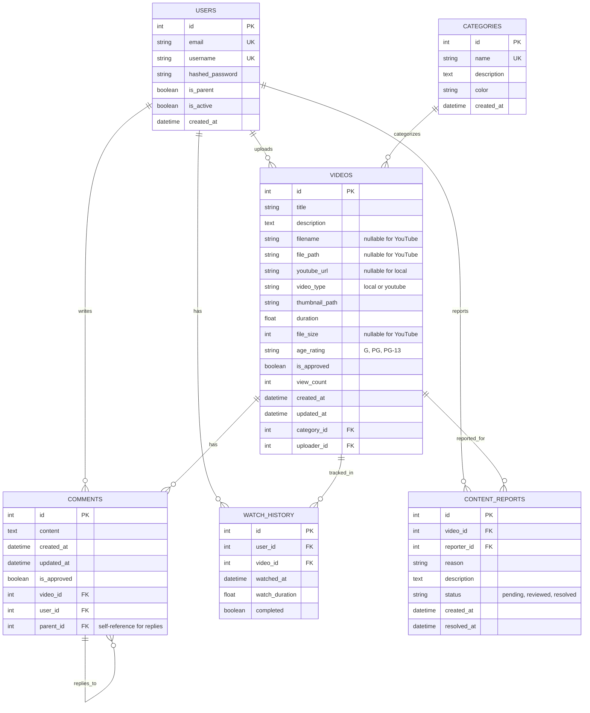

## 🏗️ Component Architecture

### Frontend Component Hierarchy
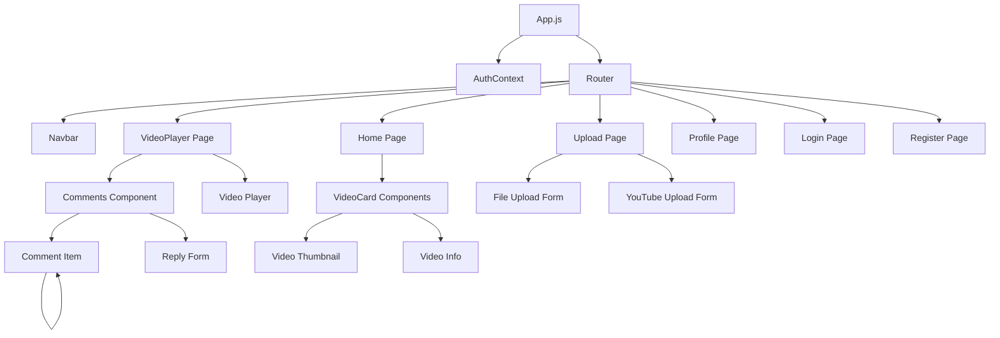

### Backend Service Architecture
```mermaid
graph TD
    A[FastAPI Main App] --> B[Authentication Service]
    A --> C[Video Service]
    A --> D[Comment Service]
    A --> E[User Service]
    A --> F[Category Service]
    
    B --> G[JWT Handler]
    B --> H[Password Hasher]
    
    C --> I[File Upload Handler]
    C --> J[YouTube Integration]
    C --> K[Video Processing]
    C --> L[Content Moderation]
    
    D --> M[CRUD Operations]
    D --> N[Nested Comments Logic]
    
    K --> O[FFmpeg Processor]
    K --> P[Thumbnail Generator]
    
    J --> Q[YouTube Utils]
    J --> R[oEmbed API Client]
    
    L --> S[Content Filter]
    L --> T[AI Moderation (Future)]
```

## 🔐 Security Architecture

### Authentication & Authorization Flow
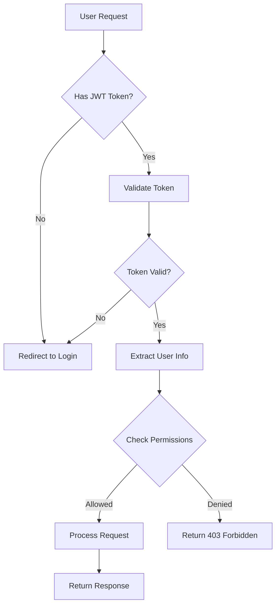

### Content Security Pipeline
```mermaid
graph TD
    A[Content Upload] --> B[File Type Validation]
    B --> C[Size Validation]
    C --> D[Content Scanning]
    
    D --> E{YouTube Video?}
    E -->|Yes| F[URL Validation]
    E -->|No| G[File Analysis]
    
    F --> H[oEmbed Check]
    H --> I[Basic Content Filter]
    
    G --> J[FFmpeg Analysis]
    J --> K[AI Content Analysis (Future)]
    
    I --> L{Safe for Kids?}
    K --> L
    
    L -->|Yes| M[Auto Approve]
    L -->|No| N[Queue for Manual Review]
    L -->|Uncertain| O[Queue for Manual Review]
```

## 🚀 Deployment Architecture

### Development Environment
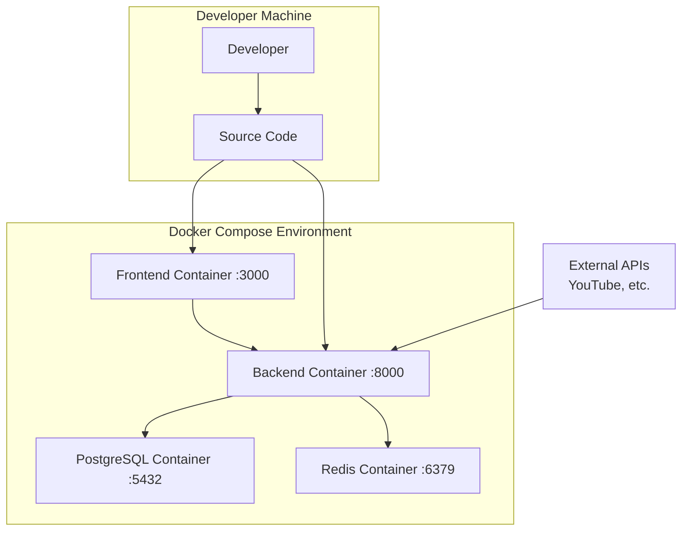

### Production Environment
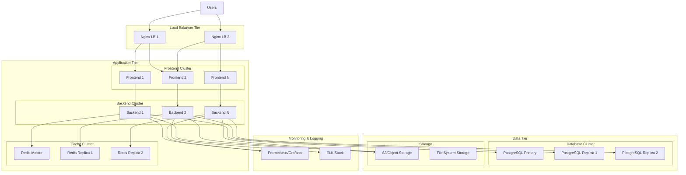

## 📊 Data Pipeline Architecture

### Video Processing Pipeline
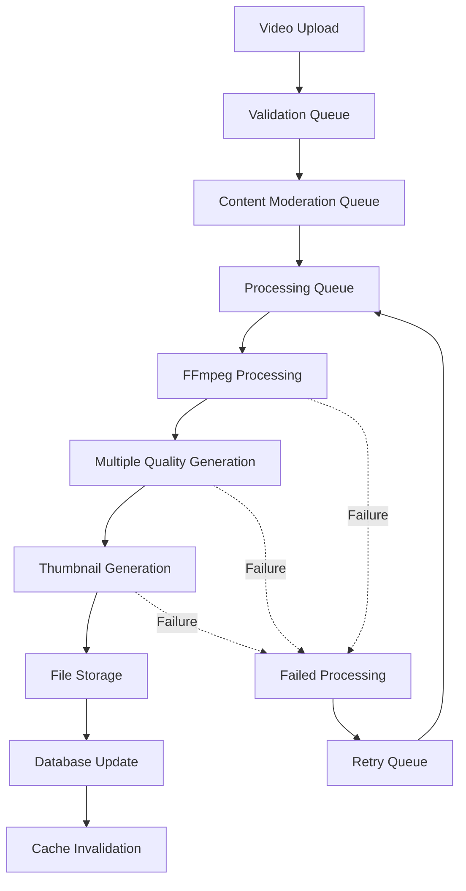

### Comment Processing Pipeline
```mermaid
graph TD
    A[Comment Submission] --> B[Authentication Check]
    B --> C[Content Validation]
    C --> D[Spam Detection]
    
    D --> E{Auto Approve?}
    E -->|Yes| F[Save to Database]
    E -->|No| G[Moderation Queue]
    
    F --> H[Update Cache]
    H --> I[Real-time Notification (Future)]
    
    G --> J[Manual Review]
    J --> K{Approved?}
    K -->|Yes| F
    K -->|No| L[Reject & Log]
```

## 🔍 Monitoring Architecture

### Metrics Collection
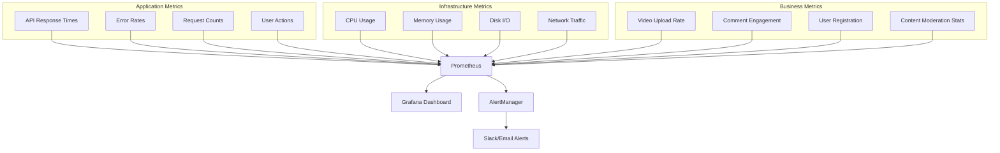

---

## 📝 Diagram Legend

### Symbols Used:
- 🔵 **Circle**: External services/APIs
- 🟦 **Rectangle**: Internal services/components  
- 🟨 **Diamond**: Decision points
- 🟩 **Database**: Data storage
- 🔶 **Hexagon**: Load balancers/proxies
- ➡️ **Solid Arrow**: Data flow
- ➡️ **Dotted Arrow**: Optional/future flow

### Color Coding:
- **Blue**: Frontend components
- **Green**: Backend services
- **Orange**: External services
- **Purple**: Data storage
- **Red**: Security/authentication
- **Gray**: Infrastructure

---

📊 **Note**: Những diagrams này được tạo bằng Mermaid và có thể được render trong GitHub, GitLab, và hầu hết các markdown viewers hiện đại.